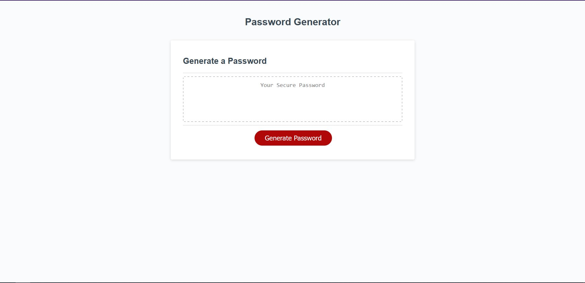

# Password Generator

## Description

This website generates a password from 8-128 characters. It allows the user to pick if they choose to include lower/uppercase letters, numbers, and special characters. This program helps with generating strong complex passwords sensitive applications. 

## Link to webpage: josephteklu.github.io/Password-Generator

## Created by Joseph Teklu

## MIT License (check directory)
